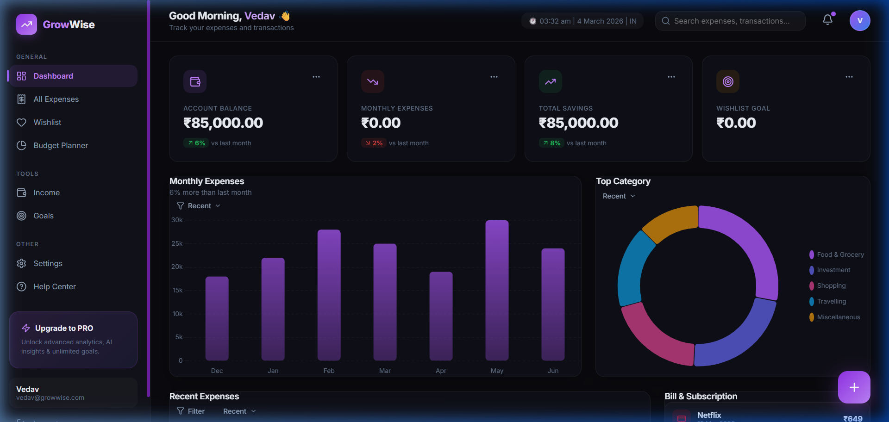
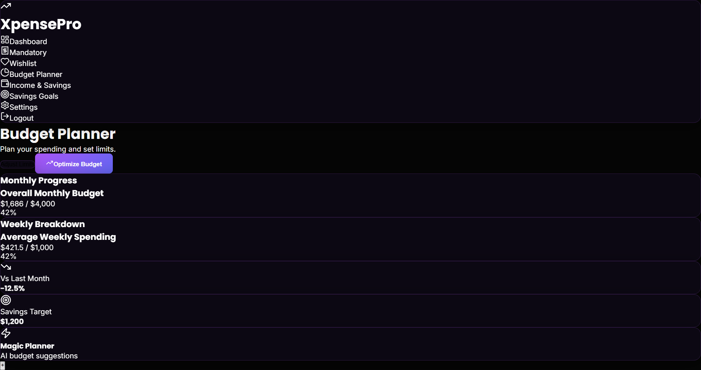
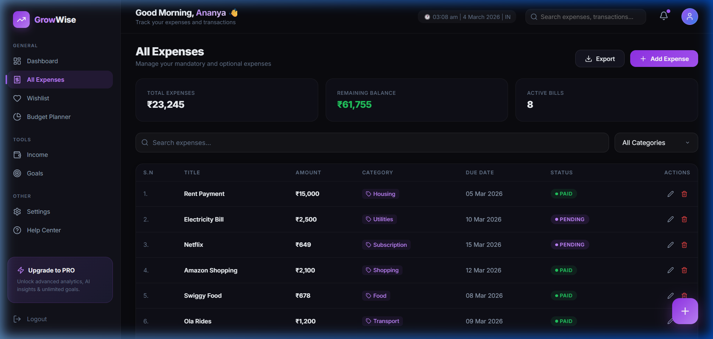
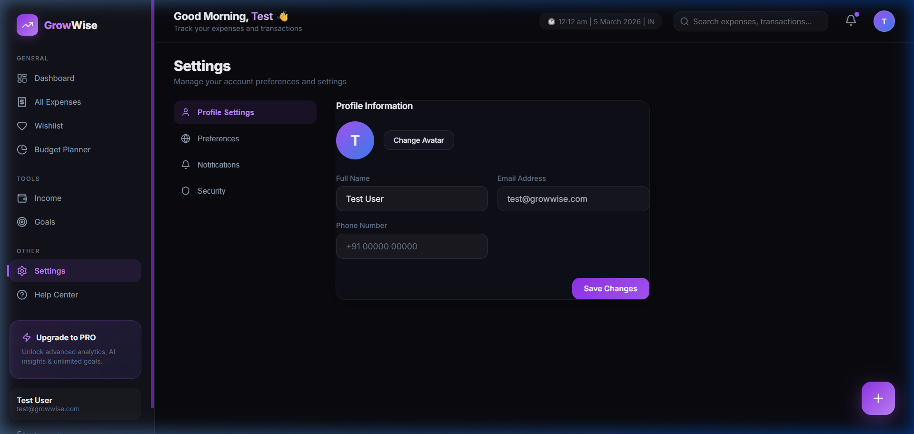

# GrowWise Expense Tracker 💸

A premium, modern personal finance web application with a sleek dark theme. **GrowWise** is designed to help you take control of your financial life with dynamic visualizations, real-time spending tracking, customizable category budgets, and goal-oriented wishlists.

## ✨ Features

- **Personalized Dashboard**: View your account balance, monthly expenses, total savings, and interactive spending charts at a glance.
- **Dynamic Category Budgets**: Create custom categories (e.g., Food, Transport, Utilities) with customizable budget limits and colors. Progress bars track your real-time spending.
- **Detailed Expense Tracking**: Log expenses quickly with dates, categories, and statuses. Filter and search your recent transactions.
- **Wishlist Planner**: Set goals for future purchases, track the estimated cost, set priority levels, and mark them as purchased when ready.
- **Authentication**: Secure JWT-based authentication so your financial data remains private.
- **Premium Aesthetics**: A stunning dark-mode-first design with a black/violet color palette, glassmorphism elements, and smooth modern animations.

## 📸 Screenshots

### 📊 Dashboard
The main command center showing your financial overview and spending trends.


### 🥧 Budget Planner (Category Limits)
Set custom budget categories and track how much you have spent relative to your monthly goals.


### 🧾 Expenses View
A detailed tabular view of all your recorded expenses, easily filterable.


### ⚙️ Settings Profile
Manage your account details and application preferences.


---

## 🛠️ Technology Stack

**Frontend**
- **React.js** (Vite) for the UI framework
- **Chart.js** & `react-chartjs-2` for interactive data visualizations
- **Lucide React** for beautiful, consistent iconography
- Vanilla **CSS** with modern CSS modules and properties (no heavy CSS frameworks)

**Backend**
- **Node.js & Express.js** for the REST API
- **Prisma** (ORM) connected to a **SQLite** database for persistent storage
- **Bcrypt.js** & **JSON Web Tokens (JWT)** for secure password hashing and authentication
- **Cors** and **Dotenv** for server configuration

## 🚀 Getting Started

Follow these instructions to run GrowWise on your local machine.

### Prerequisites
- Node.js (v18+ recommended)
- Git

### Installation

1. **Clone the repository:**
   ```bash
   git clone https://github.com/Vedupaul/Growwise.git
   cd Growwise
   ```

2. **Install Frontend Dependencies:**
   ```bash
   npm install
   ```

3. **Install Backend Dependencies:**
   ```bash
   cd server
   npm install
   ```

4. **Set up the Database & Environment Variables:**
   Create a `.env` file in the `server` directory with the following contents:
   ```env
   DATABASE_URL="file:./dev.db"
   JWT_SECRET="your_secure_random_string_here"
   PORT=5000
   ```
   Then, initialize the database using Prisma:
   ```bash
   # From the server calendar
   npx prisma migrate dev --name init
   ```

### Running the Application

You will need two terminals to run both the frontend and backend servers simultaneously.

**Terminal 1 (Backend Server):**
```bash
cd server
node src/index.js
```
*The backend API will start on http://localhost:5000*

**Terminal 2 (Frontend Client):**
```bash
# In the root 'Growwise' directory
npm run dev
```
*The React app will start on http://localhost:5173*

Open your browser to the frontend url, register a new account, and explore your new financial planner!

---

*Designed and developed by Vedupaul.*
